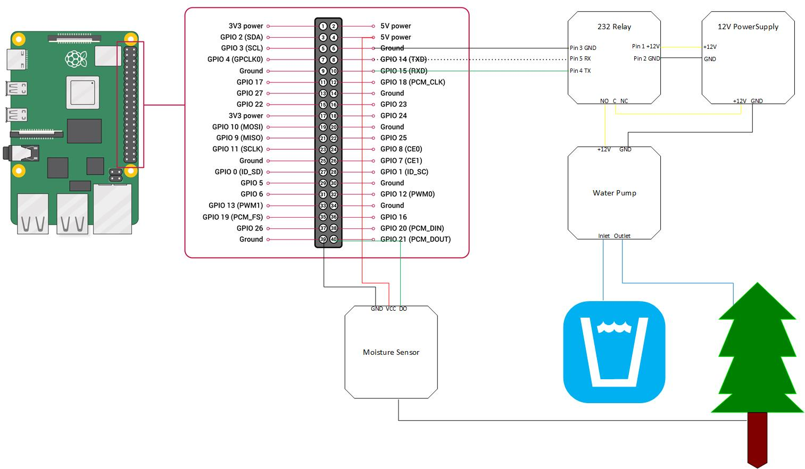

# wet_my_plants
Raspberry PI Project for Derek to automatically water plants

__TODO:__ Add table of pinout? Raspberry Pi setup, Python code


## Hardware
- Raspberry PI 3
- 12V Power Supply
- [Moisture Sensor](https://www.amazon.com/Gikfun-Capacitive-Corrosion-Resistant-Detection/dp/B07H3P1NRM/ref=sr_1_3?crid=2XJYCR5C64V3E&dchild=1&keywords=gikfun+capacitive+soil+moisture+sensor&qid=1606313177&sprefix=gikfun+moisture%2Caps%2C131&sr=8-3)
- [Water Tube 8mmx12mm](https://www.amazon.com/Quickun-Silicone-Tubing-Flexible-Transfer/dp/B08BR63TLS/ref=sr_1_3?dchild=1&keywords=quickun+pure+silicone+tubing+8mm&qid=1606313266&sr=8-3)
- [Mini Submersible Water Pump](https://www.amazon.com/LEDGLE-Submersible-Ultra-Quiet-Dual-Purpose-Hydroponics/dp/B085NQ5VVJ/ref=sr_1_7?dchild=1&keywords=mini+submersible+water+pump&qid=1606313335&sr=8-7)
- Bread board
- Various Cables to connect
- Serial Controlled Relay


---    

## Block Diagram



## Setting up the Raspberry PI

I'm going to assume you know how to turn on the raspberry pi and can connect it to a monitor, keyboard, and mouse.

I was pretty lazy when it came down to choosing which image to use for the raspberry pi. I stuck with the default raspian noobs image that came out of the box. In order for the raspberry pi to communicate to the 232 relay, we need to enable the serial comms on the GPIO pin board. Execute the following in a konsole on the raspberry pi

### Enable Serial
```sh
sudo raspi-config
```
1. Select Interface options
2. Select option P6 - Serial Port
    - -*Would you like a login shell to be accessible over serial?*-
        - Select No
    - -*Would you like the serial port hardware to be enabled?*-
        - Select Yes
3. Exit raspi-config and reboot for the changes to take effect      

__NOTE:__
These are the settings of the serial port we'll be interfacing with

| Setting  | Value      |
| -------- | ---------- |
| Port     | /dev/ttyS0 |
| Baudrate | 9600       |


## Ethernet setup
You can also use a ethernet controlled relay to save yourself some space on the GPIO board or if you're more comfortable using python socket library. You can set a static IP on eth0 to communicate to the ethernet device. The raspberry pi is a little different than other linux distros where you'll modify the '/etc/network/interfaces' or the '/etc/sysconfig/network-scripts/ifcfg-<dev>' file. You'll need to add the following lines to the /etc/dhcpcd.conf file on the raspian image.


```sh
sudo vim /etc/dhcpcd.conf
```

Add the following to the bottom of the '/etc/dhcpcd.conf' file

```
interface eth0

static ip_address=192.168.1.94/24
static routers=192.168.1.1
static
domain_name_servers=192.168.1.1
```

Then you'll need to reboot the raspberry pi

```sh
sudo reboot
```

## Setting up the code

The code needs to run off of python3.4+. By default, the raspberry pi's image has both 'python2.7' and 'python3.4' so we won't need to install python3+.

Make a directory to put the code, clone repository, and go into that directory
```sh
mkdir ~/git/
git clone https://github.com/dmon6/wet_my_plants.git
cd ~/git/wet_my_plants
```

Install virtualenv for a clean workspace for python
```sh
pip3 install virtualenv
```

Create a new virtualenv and activate. In this tutorial I name my environment "env"
```sh
# Creates virtualenv called env
virtualenv -p python3 env

# Activate env
source env/bin/activate

# If you ever need to deactivate the env run this
deactivate
```

After activating 'env', you should see '(env)' in your prompt
```sh
(env)pi@somewhere wet_my_plants $
```

Install requirements.txt for all the dependencies needed for the web app
```sh
pip3 install -r requirements.txt
```

Run the flask app
```sh
python app.py
```

The server is currently set to debug mode, you can see the site at localhost:5000