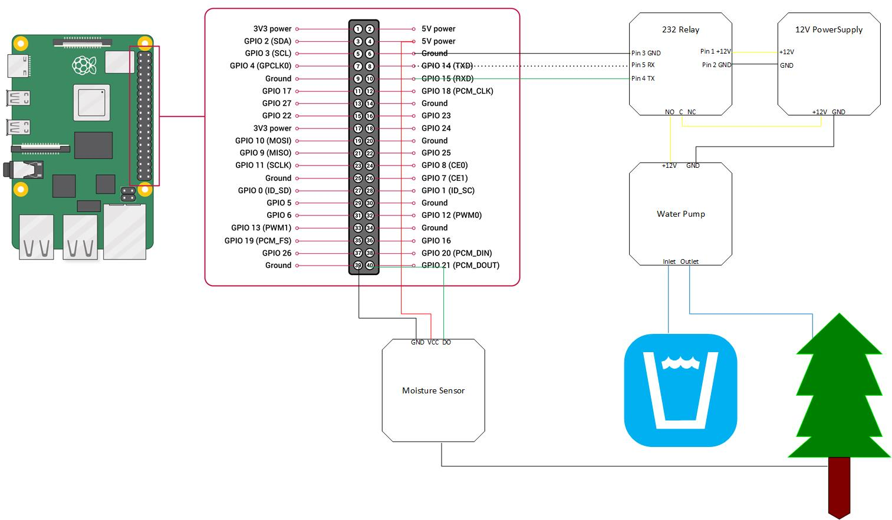

# wet_my_plants
Raspberry PI Project for Derek to automatically water plants

__TODO:__ Add table of pinout? Raspberry Pi setup, Python code

## Hardware
- Raspberry PI 3
- 12V Power Supply
- [Moisture Sensor](https://www.amazon.com/Gikfun-Capacitive-Corrosion-Resistant-Detection/dp/B07H3P1NRM/ref=sr_1_3?crid=2XJYCR5C64V3E&dchild=1&keywords=gikfun+capacitive+soil+moisture+sensor&qid=1606313177&sprefix=gikfun+moisture%2Caps%2C131&sr=8-3)
- [Water Tube 8mmx12mm](https://www.amazon.com/Quickun-Silicone-Tubing-Flexible-Transfer/dp/B08BR63TLS/ref=sr_1_3?dchild=1&keywords=quickun+pure+silicone+tubing+8mm&qid=1606313266&sr=8-3)
- [Mini Submersible Water Pump](https://www.amazon.com/LEDGLE-Submersible-Ultra-Quiet-Dual-Purpose-Hydroponics/dp/B085NQ5VVJ/ref=sr_1_7?dchild=1&keywords=mini+submersible+water+pump&qid=1606313335&sr=8-7)
- Bread board
- Various Cables to connect
- Serial Controlled Relay

## Software
- Raspian image
- Python 3.4+
    - flask
    - RPi.GPIO
    - pyserial

---    

## Block Diagram

